# 全程记录webpack公用文件预打包过程

## 建立项目目录
    建立test-common-files目录，双击进去，npm init一阵回车
   
   最后结果
   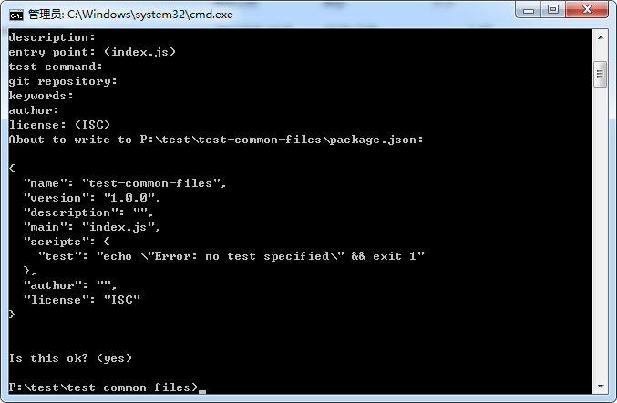

## 目录结构
  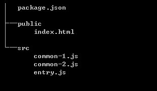

  - public为html模板目录     
  - src为源码目录
  - common-1.js及common-2.js为公用文件，我们将它俩预打包
  - entry.js为入口文件

## 相关文件内容
- webpack.config.js （暂空，后面补填）
- index.html

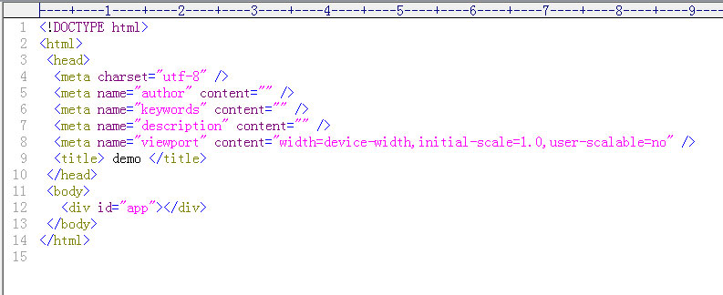

- common-1.js 一个简单常用的选择器

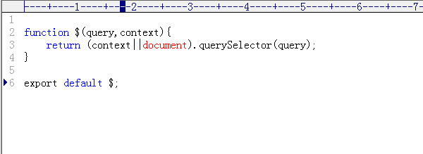

- common-2.js 一个设样式的函数

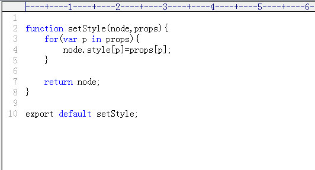

- entry.js 入口文件

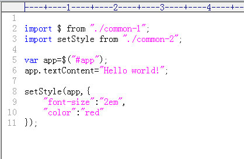

效果：hello world，两倍红字！

## 安装webpack及html-webpack-plugin
（根据你的网速快慢，等一段时间。。。）
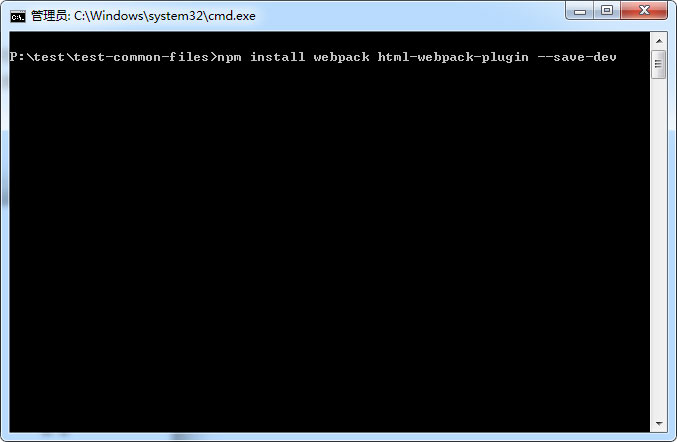

## 安装babel相关模块
因为用的是es6的导入导出，所以要安装babel-loader、babel-core、babel-preset-es2015

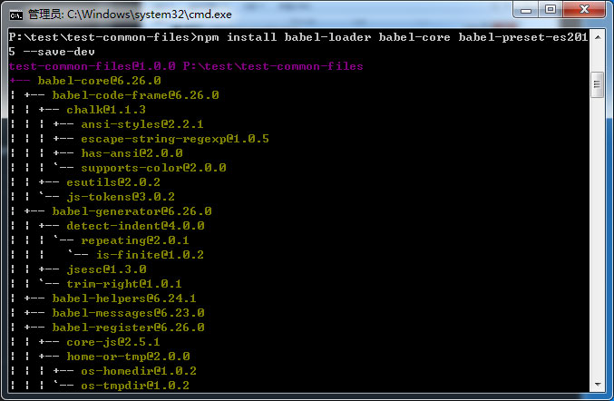

## 根目录下建立配置文件 config.js
方便统一调用

## 配置生成公用js文件环境 webpack.dll.config.js
原理：利用webpack.DllPlugin插件生成清单文件

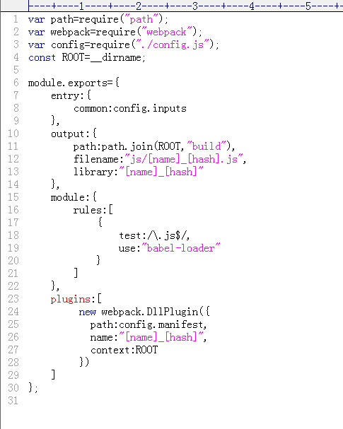

### 简单说明
   - output.library值为最终生成js文件的导出、导入变量名（唯一值，且要符合js的变量命名规范）
   即 return __webpack_require__(__webpack_require__.s = 0);的返回结果
   - DllPlugin.name要跟output.library一致，该值用于生成清单的name值，最终module引用module.exports = name 值（即module.exports=output.library（js变量)
   - 故，libaray必须跟name一致，且符合js变量命名规范！

## 配置普通webpack.config.js
原理：利用webpack.DllReferencePlugin导入清单文件

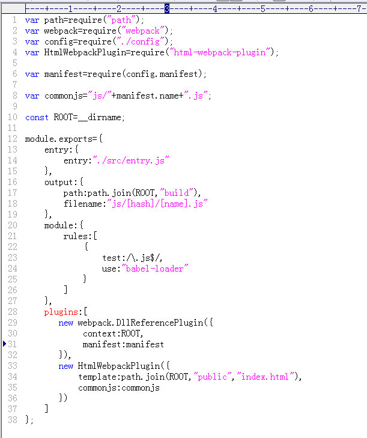

## 修改index.html模板
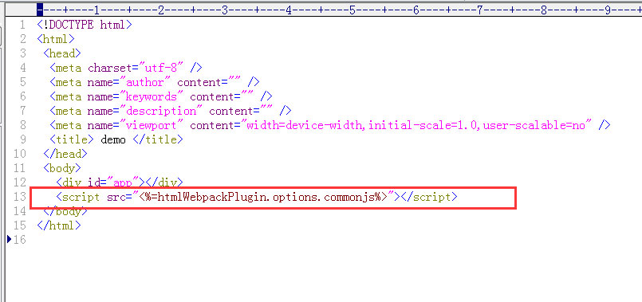

红框内加上生成的公用js文件

## 完成配置的目录结构
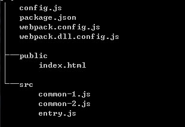

图中已去除了node_modules目录

---
## 接下来是命令行操作部分

## 预先生成 dll清单
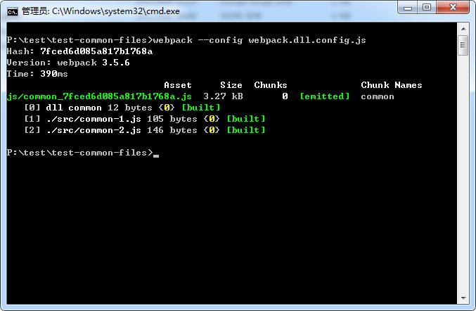

命令可在package.json中配置，在此不多提。
效果：在根目录下多了一个commons-manifest.json文件，build中也有相关公用js文件

## 最终build
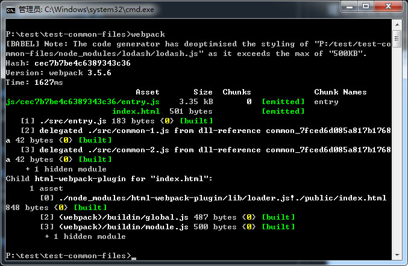

该命令在常见框架中，一般设为npm run build。在package.json中配置即可，也不多提。

## 打开build/index.html文件看到最终效果

Hello world!
最终源码

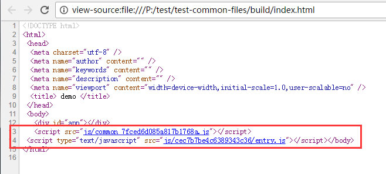
---
over!

      

  
